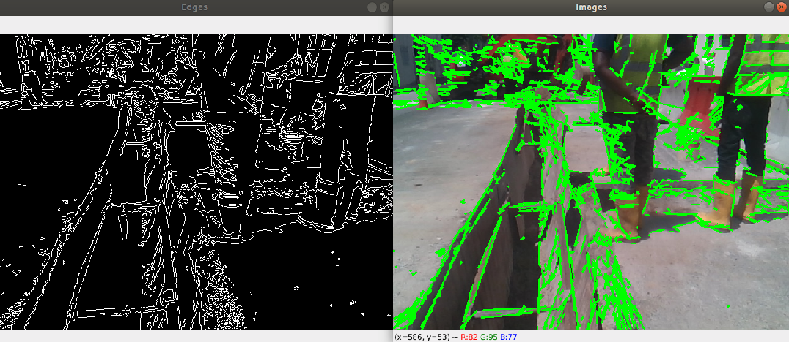

# A simple Hough Transform starter

This is a starter project using OpenCV Hough Transform to detect lines.  
You can get each frame from a video mp4 file in a loop.  
This starter project just demonstrate 1 frame from an image.jpg.  

The original image.  
 

Using OpenCV Canny functions to get the edges and Hough functions to detect the lines.  
 

This is largely inspired by a video from  
https://www.youtube.com/watch?v=KEYzUP7-kkU

## Pre-requisites

Using pip3 and python3:
```sh
pip3 install --upgrade pip
pip3 install opencv-python
```

## OpenCV

Typically, you would covert RGB image to gray image.  
Use Canny function to get the edges from the gray image.  
With the edges, use HoughLinesP function to get the lines.  
```python
img = cv2.imread("video/image.jpg")
gray = cv2.cvtColor(img, cv2.COLOR_BGR2GRAY)
edges = cv2.Canny(gray, 75, 150)

# get array of lines from HoughLinesP
# uses maxLineGap to close the line gaps
lines = cv2.HoughLinesP(edges, 1, np.pi/180, 50, maxLineGap=5)
```

## Computer Vision Concepts

### Canny
The Canny algorithm helps to separate foreground from the background.  
It gets boundaries of objects and detects edges in an image.  
From these edges you get you get the pixels, which are then translated to an Edge map containing Edge Points (x,y).  


