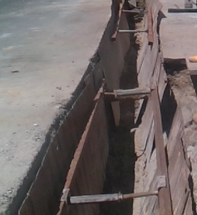

# A simple Hough Transform starter

This is a starter project using OpenCV Hough Transform to detect lines.  
You can get each frame from a video mp4 file in a loop.  
This starter project just demonstrate 1 frame from an image.jpg.  

The original image.  
 

Using OpenCV Canny functions to get the edges and Hough functions to detect the lines.  
 

This is largely inspired by a video from  
https://www.youtube.com/watch?v=KEYzUP7-kkU

## Pre-requisites

Using pip3 and python3:
```sh
pip3 install --upgrade pip
pip3 install opencv-python
```

## OpenCV

Typically, you would covert RGB image to gray image.  
Use Canny function to get the edges from the gray image.  
With the edges, use HoughLinesP function to get the lines.  
```python
img = cv2.imread("video/image.jpg")
gray = cv2.cvtColor(img, cv2.COLOR_BGR2GRAY)
edges = cv2.Canny(gray, 75, 150)

# get array of lines from HoughLinesP
# uses maxLineGap to close the line gaps
lines = cv2.HoughLinesP(edges, 1, np.pi/180, 50, maxLineGap=5)
```

## Computer Vision Concepts

Some concepts here to better understand what the OpenCV functions are doing.

### Canny
The Canny algorithm helps to separate foreground from the background.  
It gets boundaries of objects and detects edges in an image.  
From these edges you get you get the pixels, which are then translated to an Edge map containing Edge Points (x,y).  

### Hough Transform Concept
This algorithm helps to find straight lines from a bunch of points
The line equation:  
```
y = mx + c
=> c = -mx + y
```
The [Hough Transform Concept is best explained by Shree Nayar](https://www.youtube.com/watch?v=XRBc_xkZREg)

**Image Space (line)**: `y = mx + c`.  
**Parameter Space (line)**: `c = -mx + y`. 


The points(x,y) from a straight line in Image Space lines equals to (pass through) the Intersection point(m,c) in Parameter Space.  

An Accumulator array A(m,c) in **Parameter Space**
- is a matrix of points from lines c = -mx + y. 
- the point of intersection from points from these lines will have highest accumulated value. 
Hence, the **Image Space** Points that corresponds to the Intersection Point in Parameter Space are the points from a straight line.  

However, massive array to span all possible values of **m**.
Therefore, we can use `x sin deta - y cos deta + p = 0`:  
where Orientation deta is finite: 0 <= deta < pixels  
and Distance p is finite  

In **Image Space**: points on straight lines are Parameter Space sinosoids.  
In Accumulator array (p, deta), the sinosoids peaks at intersections indicate the detected lines.  


Alternatively, [here is another take in terms of `x-y plane` corresponding to `m-c plane`, where finally you see the m,c lines intersect](https://www.youtube.com/watch?v=t1GXMvK9m84). 


With a bunch of x,y points, they can be substituted in the equation to derive the m,c points.  
Where the m,c points are the same, a.k.a. highest accumulated value in Accumulator array A(m,c), the x,y points are points from a straight line.  


