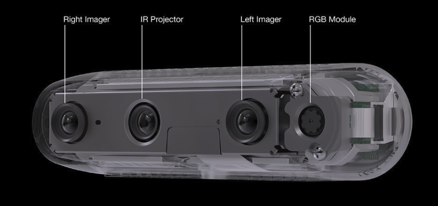
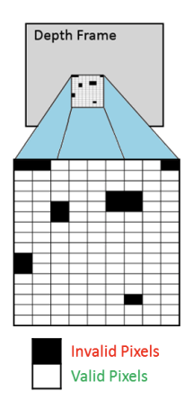

# A simple Computer Vision starter

This is a starter project using OpenCV and Intel RealSense camera.  
This is largely inspired by 
https://pysource.com/2021/03/11/distance-detection-with-depth-camera-intel-realsense-d435i/

## Some RealSense Tech Specs

### Stereo Vision Depth Technology Overview



The Intel® RealSense™ D400 series depth camera uses stereo vision to calculate depth. The stereo vision implementation consists of a left imager, right imager, and an optional infrared projector. The infrared projector projects a non-visible static IR pattern to improve depth accuracy in scenes with **low texture**. Example of low or poor texture objects are plain blank walls, books pages, or flat objects containing equal symmetric patterns.  

The left and right imagers capture the scene and send imager data to the depth imaging (vision) processor, which calculates depth values for each pixel in the image by correlating points on the left image to the right image and via the shift between a point on the Left image and the Right image. The depth pixel values are processed to generate a depth frame. Subsequent depth frames create a depth video stream

### Accuracy
Range up to 10m.  
<2% error at 2m.  

Error rate:  



## Pre-requisites

Using pip3 and python3:
```sh
pip3 install --upgrade pip
pip3 install opencv-python
pip3 install pyrealsense2
```

## Stereo Depth Concepts

Imagine "Stereo" as in stereo sound vs mono sound. 2 speakers produce better audio quality 👍.  
The fortunate among us, we have 2 eyes - The Stereo Depth camera has 2 cameras sensors to detect depth.  
Better than us, it can give accurate estimates of the distance of a targeted objects.  
For example, as an analogy, imagine you "wear" these 2 "Stereo" lenses in your eyes, and you look at me.  
It can tell you that we are 2345mm apart.  
On autonomous driving vehicle, it can tell the distance of the car in front and hence at what speed to overtake the car.  

More destructive examples are be used by military drones.  

### 2D Points to 3D Points, and vice-versa

The camera uses two sensors calibrated to detect depth.  
It can tranform 2D point to 3D point and vice-versa.  

E.g. Equations 2D Points (u,v) to 3D Point
```
u = fx(x/z) + Ox
v = fy(y/z) + Oy
```
to the corresponding horizontal Point(u,v) from baseline b (a.k.a. Stereo Matching technique).  
```
u = fx(x - b/z) + Ox
v = fy(y/z) + Oy
```
Project 2 lines from these to points until the 2 lines meet (at an object in line of sight).  
Where the 2 lines intersect at a 3D Point (x, y, z). 
"*Given a point from an image, where is the outgoing ray (line of sight) point to ?*".  
This concept is best explained by [Shree Nayar](https://www.youtube.com/watch?v=hUVyDabn1Mg).  


## References:  
[Depth range](https://www.intelrealsense.com/depth-camera-d435/#:~:text=A%20Powerful%2C%20Full%E2%80%91featured%20Depth%20Camera&text=With%20a%20range%20up%20to,2.0%20and%20cross%2Dplatform%20support.)  
[Tuning](https://dev.intelrealsense.com/docs/tuning-depth-cameras-for-best-performance)  
[RealSense Sample Codes](https://github.com/IntelRealSense/librealsense)  
